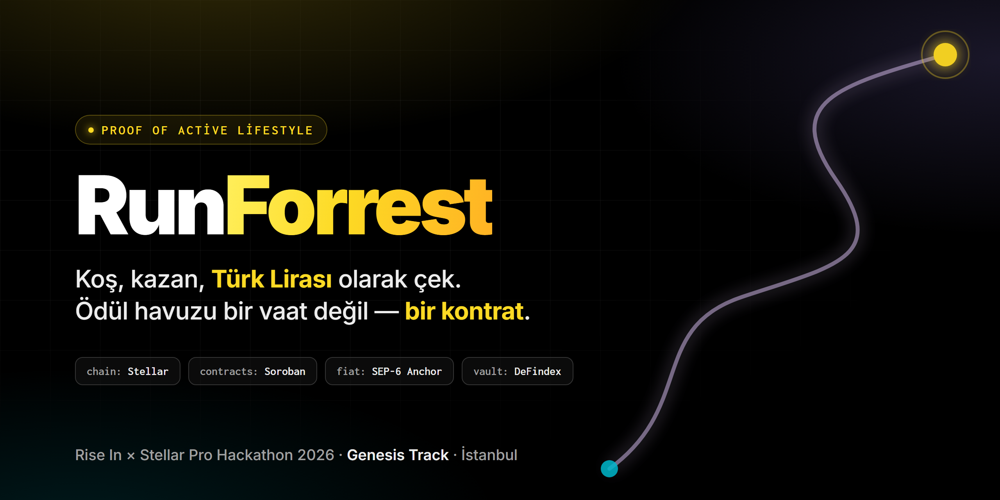
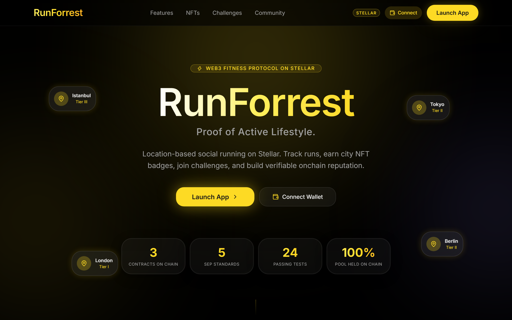
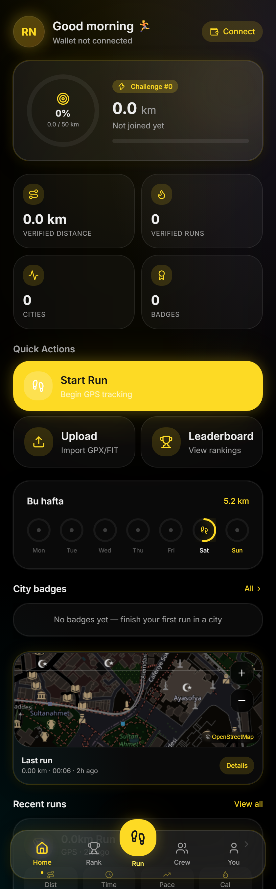
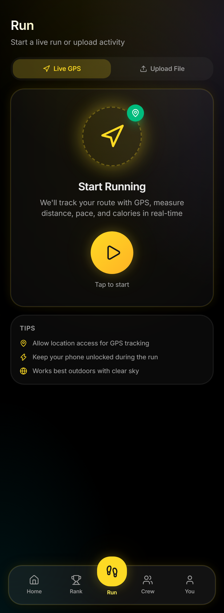
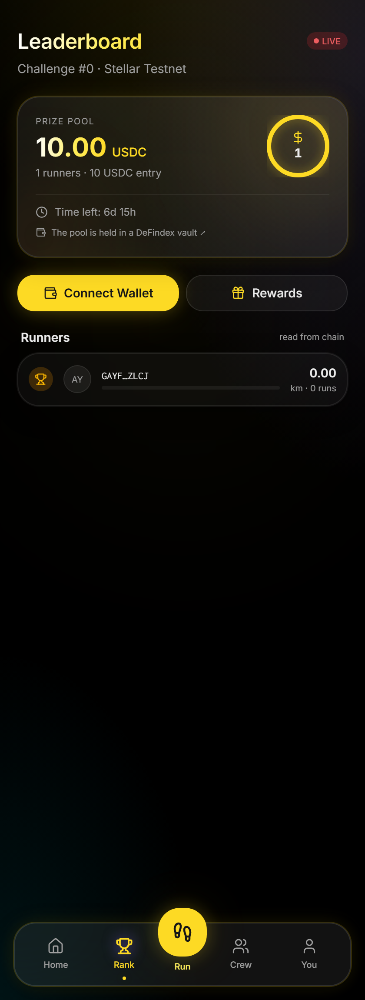
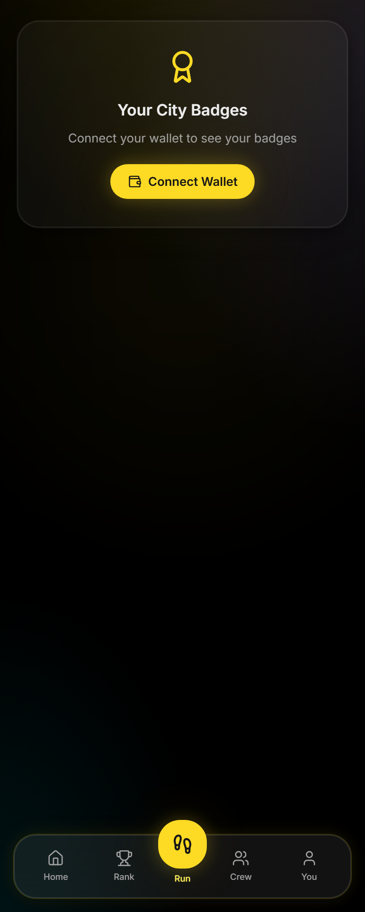
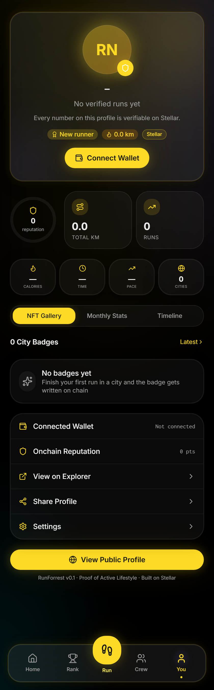
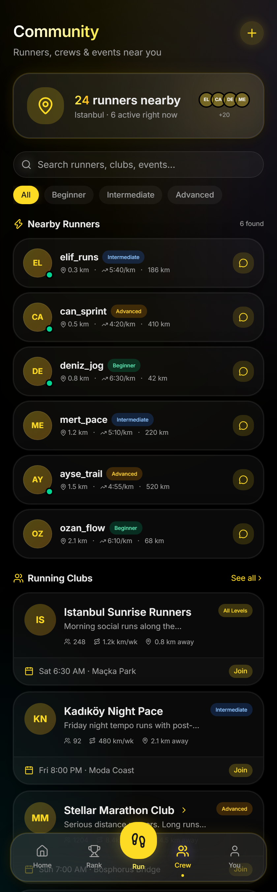
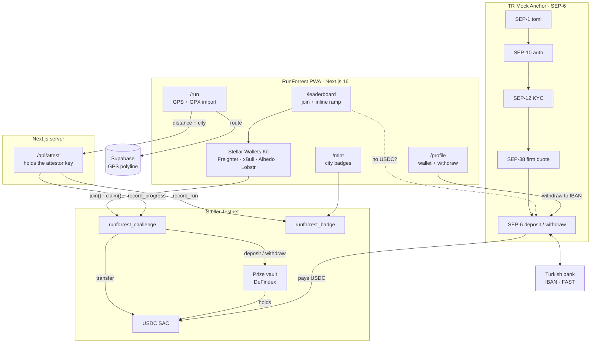
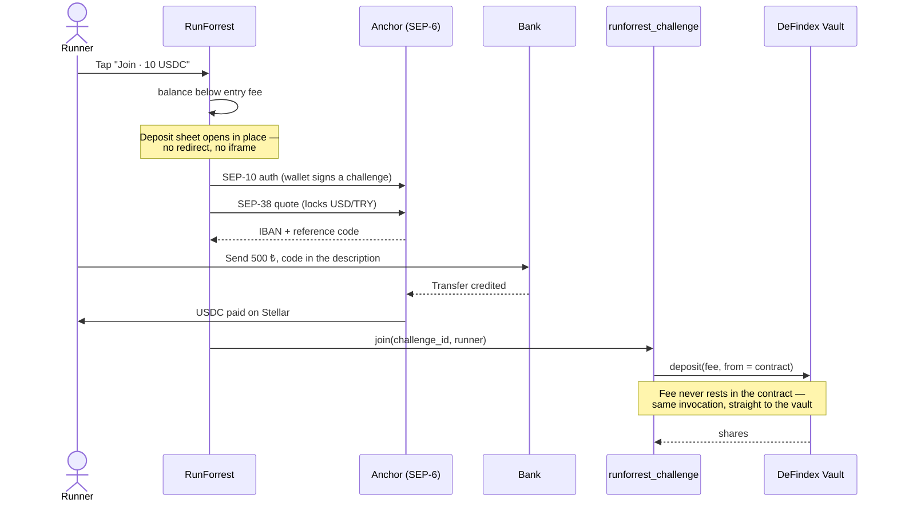

<div align="center">



**A running app where the prize pool is a contract, and the entry ramp is a Turkish bank transfer.**

Rise In × Stellar Pro Hackathon 2026 · **Genesis Track** · Istanbul

[](https://runforrest.vercel.app)
[](https://stellar.org)
[](https://developers.stellar.org)
[](https://nextjs.org)
[](#testing)
[](#the-fiat-rail)

</div>

**Jump to:** [Submission checklist](#submission-at-a-glance) · [The problem](#the-problem) · [What it does](#what-runforrest-does) ·
[Screenshots](#what-it-looks-like) · [Deployed contracts](#live-on-stellar-testnet) ·
[Try it](#try-it) · [Architecture](#architecture) · [How it works](#how-the-pieces-work) ·
[Design decisions](#design-decisions) · [Trust assumptions](#trust-assumptions) ·
[Bugs the chain caught](#two-bugs-the-live-chain-caught) · [Testing](#testing) ·
[Run it locally](#getting-started) · [Roadmap](#roadmap)

---

## Submission at a glance

Everything the hackathon asks for, and where to find it.

| Requirement | Where |
|---|---|
| Public GitHub repository | you are in it |
| Well-structured README | this file — technical documentation lives here, as the brief allows |
| Smart contracts on Stellar Testnet | [three contracts, with IDs and WASM hashes](#live-on-stellar-testnet) |
| Front-end / application URL | **[runforrest.vercel.app](https://runforrest.vercel.app)** |
| Working live demo | the URL above is functional and public — [60-second path](#try-it) |
| Documented contract IDs and artifacts | [below](#live-on-stellar-testnet), plus [`deployments.json`](deployments.json) |
| Built with the Soroban SDK | `soroban-sdk` 23, [`contracts/`](contracts/) |
| Pitch presentation | **[View the deck](https://www.canva.com/design/DAHVuMiqFXI/eNNRwCmvZ577qQMFaC12jg/view)** — the official template, filled, structure intact · [`.pptx`](RunForrest-Pitch.pptx) |
| Track | **Genesis** |

**The narrative in one paragraph.** Runners in Turkey have no verifiable path
between a bank account and a prize pool. RunForrest makes the pool a contract
instead of a promise, and the on-ramp a bank transfer instead of an exchange
account. A runner pays a 500 ₺ entry from their own bank, runs, and cashes
winnings out to their IBAN — without ever buying crypto, and without trusting an
organiser to hold the money honestly. The [problem](#the-problem),
[who it is for](#who-it-is-for) and [why it generalises](#why-it-generalises) are
below in full.

---

## The problem

A runner in Istanbul wants to join a 10 USDC distance challenge.

To do that today, they must find an exchange, pass KYC, buy crypto, learn what a
wallet is, move funds, and only then reach the app. Most stop at step one. And if
they win, the money has to travel all the way back through the same wall.

Meanwhile the prize pool itself sits in an organiser's wallet. Participants cannot
verify the pool exists, cannot confirm the payout rule, and have no recourse if the
organiser disappears. "Trust us" is the entire mechanism — which is why most local
running challenges are either free, or run on personal trust between people who
already know each other.

Two separate walls, both made of the same material: **there is no verifiable path
between a Turkish bank account and a prize pool.**

## What RunForrest does

**The pool is a contract, not a promise.** Entry fees never rest in an operator
wallet. `join()` transfers the fee in and deposits it into a DeFindex vault in the
same invocation — the challenge contract's USDC balance is `0` between calls. The
payout split is fixed in code. `finalize()` is permissionless once the window
closes, so nobody can hold the prize hostage.

**The ramp is a bank transfer.** A runner with zero crypto sends Turkish lira from
their own bank with a reference code in the description, and USDC lands in their
wallet. Winnings go back out to an IBAN the same way. This runs on Stellar's SEP
standards, so the same integration works against any production Stellar anchor by
changing one value: the home domain.

**The proof is on-chain.** Distance, participation, pool balance and city badges
live in contract state. Every number the app shows about your running can be
checked by someone who does not trust the app.

### Who it is for

Runners in Turkey who want their effort to be worth something, and who should not
have to learn what a seed phrase is to enter a 500 ₺ challenge. Secondarily:
running clubs and event organisers who need a prize pool their members can audit.

### Why it generalises

The hard part of consumer crypto in Turkey is not the chain — it is the last mile
to a bank account. The ramp code here is not app-specific; it is the standard SEP
flow, and it moves to production by swapping a domain. Any Turkish consumer app
facing the same wall can reuse this shape.

---

## What it looks like

<div align="center">
  
</div>

The app is mobile-first — a runner uses it with one hand, outdoors, mid-run.

<table>
<tr>
<td width="33%"></td>
<td width="33%"></td>
<td width="33%"></td>
</tr>
<tr>
<td align="center"><b>Dashboard</b><br/><sub>Verified distance, runs and cities, all read from contract state. Nothing here is a placeholder — with no data it says so.</sub></td>
<td align="center"><b>Live run</b><br/><sub>GPS tracking with the accuracy circle drawn on the map. Poor readings still show a position but do not count toward distance.</sub></td>
<td align="center"><b>Leaderboard</b><br/><sub>Pool, roster and distances read from chain. The pool links to the DeFindex vault holding it, so the claim is checkable.</sub></td>
</tr>
<tr>
<td width="33%"></td>
<td width="33%"></td>
<td width="33%"></td>
</tr>
<tr>
<td align="center"><b>City badges</b><br/><sub>Soulbound, tiered by run count. The contract has no transfer function, so the badge cannot be bought.</sub></td>
<td align="center"><b>Profile</b><br/><sub>Every statistic derived from chain state, plus the two fiat actions: top up with lira, withdraw to an IBAN.</sub></td>
<td align="center"><b>Community</b><br/><sub>Challenges are created on chain from here; the entry fee and window are contract state, the title is cosmetic metadata.</sub></td>
</tr>
</table>

---

## Live on Stellar Testnet

**App: [runforrest.vercel.app](https://runforrest.vercel.app)**

| Contract | Address |
|---|---|
| `runforrest_challenge` | [`CAN4QVZURUX6OLBFC7IH2HQHQDUJDD72UBGJLXR67BKACWBQF4JVUWCM`](https://stellar.expert/explorer/testnet/contract/CAN4QVZURUX6OLBFC7IH2HQHQDUJDD72UBGJLXR67BKACWBQF4JVUWCM) |
| `runforrest_badge` | [`CBEMQGDLL2KNMBSINUSQM7QXMKAOMFIJDFQL27F3ZEWSRYA75WB3VCU6`](https://stellar.expert/explorer/testnet/contract/CBEMQGDLL2KNMBSINUSQM7QXMKAOMFIJDFQL27F3ZEWSRYA75WB3VCU6) |
| Prize vault (DeFindex) | [`CCHEMDA647SX2RPQ4FYQ3HLDXLVSREQSIAWXVQ2AYRMEHPQLVSGXASI7`](https://stellar.expert/explorer/testnet/contract/CCHEMDA647SX2RPQ4FYQ3HLDXLVSREQSIAWXVQ2AYRMEHPQLVSGXASI7) |

| Integration | Value |
|---|---|
| Anchor home domain | `tr-mock-anchor.fly.dev` |
| USDC issuer (Circle testnet) | `GBBD47IF6LWK7P7MDEVSCWR7DPUWV3NY3DTQEVFL4NAT4AQH3ZLLFLA5` |
| USDC Stellar Asset Contract | `CBIELTK6YBZJU5UP2WWQEUCYKLPU6AUNZ2BQ4WWFEIE3USCIHMXQDAMA` |
| DeFindex factory | `CDSCWE4GLNBYYTES2OCYDFQA2LLY4RBIAX6ZI32VSUXD7GO6HRPO4A32` |

**Deployed artifacts.** The WASM hash is what the network actually executes — it
is the thing to check, not the contract ID, which only points at it.

| Contract | WASM hash |
|---|---|
| `runforrest_challenge` | `ea45ccf927aac8031d9c843e727848ec81230f17a05757e1bc662785d6a41cd5` |
| `runforrest_badge` | `95a8c8fb8249e382f301884507bfa75de912d56acca7d62d44ccd4a0790c5727` |
| Prize vault (DeFindex) | `f345228dca59c6605789620e9ec62ff4847a0927c33dac7581a955fe746016be` |

Machine-readable: [`deployments.json`](deployments.json)


---

## Try it

**Live: [runforrest.vercel.app](https://runforrest.vercel.app)** — nothing to install.
Bring a Stellar wallet extension set to **Testnet** (Freighter recommended).

To run it locally instead:

```bash
cd web && npm install && cp .env.example .env.local && npm run dev
```

Contract IDs are pre-filled. Open `http://localhost:3000` with a Stellar wallet
extension set to **Testnet** (Freighter recommended).

**The 60-second path — no crypto required to start:**

1. **Connect.** If the account is brand new it does not exist on chain yet; the
   wallet menu offers **"Activate your account"** to create it.
2. **Enable USDC** — a one-time trustline, offered in the same menu.
3. **Leaderboard → Join.** With no USDC, the lira deposit sheet opens *in place*.
4. **Load lira.** Pick an amount; you get an IBAN and a reference code. This is a
   sandbox anchor, so press *"I sent the transfer"* to play the bank. Real testnet USDC
   arrives in your wallet.
5. **Join completes automatically** and the fee lands in the vault.
6. **Record a run** at `/run` — live GPS or GPX import. Confirm the city, save.
7. **`/mint`** now shows a real on-chain city badge.
8. **Profile → "Withdraw to IBAN"** sends USDC back out as lira.

> The interface is in English; the money is in lira. The target user is a runner
> in Istanbul who pays a 500 ₺ entry and cashes out to a Turkish IBAN — the
> localisation that matters here is the rail, not the copy.

---

## Architecture



### The join flow — where the anchor actually lives

The ramp is not a settings page. It sits inside the moment a runner needs money.



---

## How the pieces work

### `runforrest_challenge` — the prize pool

```rust
create_challenge(creator, entry_fee, start, end, target) -> u32
join(challenge_id, runner)                  // fee → vault, in one invocation
record_progress(challenge_id, runner, m)    // attestor-signed
finalize(challenge_id)                      // permissionless after end_time
claim(challenge_id, runner)                 // winner withdraws
```

Ranking is by distance. Payout is fixed in the contract: **50/30/20** for three or
more finishers, **60/40** for two, **100%** for one. The rounding remainder goes to
the last winner so the pool is always fully distributed — a property covered by a
test (`whole_pool_is_distributed_no_dust_left`).

State writes happen before transfers, so `claim()` cannot be re-entered.

### `runforrest_badge` — soulbound city achievements

Run in a city, earn a badge; keep running there, the tier advances
(**Common → Rare → Epic → Legendary** at 1/6/16/26 runs). Each city is a separate
badge with its own run count and total distance.

**There is no transfer function.** Proof of an active lifestyle that can be bought
is not proof. This also removes the entire transfer/approve attack surface —
there is nothing to drain.

### The fiat rail

We verified the anchor's `stellar.toml`: there is **no** `TRANSFER_SERVER_SEP0024`
and `/sep24/info` returns 404. So this is SEP-6, which is programmatic — meaning
we own the ramp UI rather than handing the user to an anchor-hosted popup. That is
why the deposit sheet can live *inside* the join flow instead of beside it.

```
SEP-1   discovery        home domain + asset code is the whole handoff
SEP-10  authentication   the user's Stellar key is the identity; no password
SEP-12  KYC              auto-approved in this sandbox; same call shape in production
SEP-38  firm quote       locks USD/TRY so the rate cannot move mid-transfer
SEP-6   deposit/withdraw IBAN + reference code in, treasury + memo out
```

Everything after the home domain is discovered at runtime. Moving to a production
anchor changes one configuration value.

### Attestation

`record_progress` and `record_run` require the attestor key's signature, and that
key lives server-side in `/api/attest`. The endpoint rejects distances outside
100 m – 100 km and any pace implying speed below 0.5 m/s or above 12 m/s.

This filters nonsense, not a determined liar. See
[Trust assumptions](#trust-assumptions).

---

## Design decisions

**The vault is load-bearing, not decorative.** `join()` does not park USDC in the
contract and deposit later — the fee is transferred in and deposited to the vault
in the same invocation. Remove DeFindex and there is no pool, only an accounting
fiction. This is checkable: the challenge contract's USDC balance is `0` between
calls, and the vault emits its own deposit event naming the challenge contract as
depositor.

**Cross-contract authorisation is scoped, not broad.** The vault pulls USDC from
the challenge contract via a call *deeper* than the direct invocation, so
direct-call authority does not reach it. The contract pre-authorises exactly that
one transfer with `authorize_as_current_contract` + `InvokerContractAuthEntry` —
one contract, one function, one set of arguments.

**The chain holds what matters; the database holds what does not.** Distance,
participation, pool and badges are money and reputation — on-chain. A
2,000-point GPS polyline is neither, and putting it on-chain would be both
expensive and pointless. Supabase is optional: without it, route history is
disabled and every on-chain feature still works.

**One source of truth per fact.** Challenges exist only in the contract. Keeping a
parallel `challenges` table is tempting, but it produces two realities — one that
collects money and one with an `entry_fee` column that collects nothing. Supabase
stores only cosmetic metadata (title, description, location) keyed by the on-chain
challenge id. With no database, challenges display as "Challenge #N" and nothing
breaks.

**No invented numbers anywhere in the UI.** The landing page shows contract count,
SEP count, test count — things that can be verified. The profile derives every
statistic from chain state. If a page has nothing real to show, it shows an empty
state explaining what to do, not a plausible-looking placeholder. A product whose
single claim is verifiability cannot afford decorative statistics.

**Design tokens from the source.** The palette is extracted from
`@stellar/design-system@4.0.2`, not eyeballed — gold `#fdda24` with lilac, teal,
green and red from the same `sds-theme-dark` scale. Typography is Inter +
Inconsolata, as SDS specifies. One consequence worth stating: white text fails
contrast on gold, so `--primary-foreground` is `#161616` and every gold surface
carries dark text. Full rationale: [`docs/brand/`](docs/brand/).

---

## Trust assumptions

Stated plainly, because hiding them would be worse than having them.

**GPS attestation is centralised.** A runner cannot forge distance, but *we* could:
the attestor key signs every progress write. GPS cannot be trustlessly verified in
a two-day build, and pretending otherwise would be the dishonest option.

The contract is structured so this is the *only* centralised point, and removing
it means changing one stored address rather than rewriting the contract. Path, in
order of effort: multiple independent attestors with m-of-n agreement → signed
telemetry from the device's secure element → ZK location proofs over a committed
route.

**Admin keys.** `runforrest_badge.set_minter` is admin-gated; the challenge contract's
config is set at construction and immutable. For production both should sit behind
a multisig.

**The anchor is a sandbox.** The bank leg is simulated and KYC is auto-approved.
The Stellar leg is real testnet USDC, and the SEP call shapes are identical to a
production anchor.

---

## Honest testnet limitation

**The prize pool earns no yield on testnet, and the demo does not claim otherwise.**

The reason constrains *any* DeFi integration here, not just ours. The anchor issues
Circle's testnet USDC (`GBBD47IF…`). Stellar's testnet DeFi infrastructure runs on
a different testnet USDC (`GATALTGT…`). Same ticker, different asset. Every bridge
was measured:

| Route | Result |
|---|---|
| Classic DEX path payment | 100 USDC → **0.0067 USDC** — no liquidity |
| Soroswap pair `CB5RQPRO…` | Exists, reserves ~24 / ~105 → a 10 USDC swap loses **79%** |
| Blend testnet pool `fixed_xlm_usdc` | Reserves are XLM + Blend-USDC; Circle USDC is **not a reserve in any Blend testnet pool** |

So we created **our own DeFindex vault** through the live factory, configured for
the anchor's Circle USDC, with an empty strategy set.

**Real:** vault custody, share accounting, genuine cross-contract `deposit` and
`withdraw` — all verified on chain.
**Absent:** yield, because no testnet strategy accepts this asset.

**On mainnet this disappears.** DeFindex's own mainnet configuration lists Circle
USDC (`CCW67TSZ…`) as a Blend `fixed` pool asset. The same vault takes a yield
strategy with a config change, no contract change.

---

## Two bugs the live chain caught

Both passed the local test suite and would have shipped broken. They are recorded
here because they justify testing against real protocols rather than mocks.

### 1. Minimum liquidity would have locked every prize pool forever

```
deposit returned : 100000000 shares
actual balance   :  99999000 shares   ← 1000 stroops short
```

DeFindex locks a minimum liquidity amount on first deposit, the way Uniswap does.
The contract recorded the returned value, so `finalize()` would have tried to
withdraw shares it did not own and reverted. **Every challenge would have been
permanently unfinalisable, with funds stranded in the vault.**

Fixed by measuring the real share-balance delta instead of trusting the return
value, plus a defensive cap in `vault_withdraw` so finalize can never be blocked.
Regression test: `recorded_shares_match_the_real_vault_balance`.

### 2. Soroban enums decode as arrays — and fail silently

```js
scValToNative(Status::Finalized)  // → ["Finalized"], not "Finalized"
scValToNative(Tier::Common)       // → ["Common"]
```

So `status === "Finalized"` was always false and `TIER_META[badge.tier]` was
`undefined`. Nothing threw: the leaderboard simply never showed results and the
badge page crashed on a missing gradient. Fixed with `unwrapEnum()` normalisation
in the read layer.

More findings — verified anchor response shapes, the SEP-38 direction trap, GPS
accuracy handling, map tile licensing — are in
[`docs/TECHNICAL-NOTES.md`](docs/TECHNICAL-NOTES.md).

---

## Testing

```
runforrest-challenge   14 tests
runforrest-badge       10 tests
                  ─────────
                  24 passed
```

The challenge suite runs against a **mock vault that reproduces the real vault's
minimum-liquidity behaviour**, so the bug above stays fixed. Coverage includes the
fee actually reaching the vault, double-join rejection, progress attribution, both
payout splits, full-pool distribution with no dust, idempotent finalize, and
claim-once enforcement.

End-to-end against live testnet, not mocked:

```
anchor deposit    3 × 1500 TRY → 91.78 USDC delivered on chain
anchor withdrawal 5 USDC → 242.70 TRY paid out; balance fell exactly 5.0000
lifecycle         create → join → record_progress → finalize → claim
                  balance before 81.7824086 USDC
                  balance after  81.7824086 USDC   (paid 10, won 10 back)
                  contract residue: 0
attestation       impossible pace → 422 rejected
                  valid run → badge written on chain, read back
GPS (simulated)   Kadıköy–Moda, 8 points → 655 m measured, ±12 m shown
```

Verification scripts live in [`scripts/`](scripts/) and run against live testnet.

---

## Getting started

### Prerequisites

- Node.js ≥ 18.17
- A Stellar wallet extension (Freighter recommended), set to Testnet
- For contract work: Rust with the `wasm32v1-none` target, Stellar CLI 28

### Running the app

```bash
cd web
npm install
cp .env.example .env.local     # contract IDs pre-filled
npm run dev                    # http://localhost:3000
```

To let the app write runs on chain, set `ATTESTOR_SECRET` in `.env.local` to a
funded testnet secret key. **Server-side only — never prefix it with
`NEXT_PUBLIC_`.** If it reaches the browser, anyone can write any distance.

Supabase is optional. Without it, GPS route history is disabled and every on-chain
feature still works. To enable it, run [`web/scripts/setup.sql`](web/scripts/setup.sql)
in the Supabase SQL editor and fill the two `NEXT_PUBLIC_SUPABASE_*` values;
`/api/setup-db` reports whether the tables are in place.

### Contracts

```bash
cd contracts
cargo test                                        # 24 tests
cargo build --target wasm32v1-none --release
stellar contract optimize --wasm <path>.wasm
stellar contract deploy --wasm <path>.optimized.wasm \
  --source <identity> --network testnet -- \
  --admin <G…> --usdc <USDC_SAC> --vault <VAULT> --attestor <G…>
```

> **Windows note.** Smart App Control blocks the unsigned build-script executables
> Cargo generates (`os error 4551`), so contracts are built inside WSL2. Turning
> Smart App Control off is irreversible — don't. Also, `CARGO_TARGET_DIR` must be an
> ASCII path if you build on Windows: the mingw linker cannot handle non-ASCII
> characters. Details in [`docs/TECHNICAL-NOTES.md`](docs/TECHNICAL-NOTES.md).

---

## Project structure

```
.
├── contracts/
│   ├── runforrest-challenge/     # prize pool, entry fees, ranking, payouts, vault integration
│   └── runforrest-badge/         # soulbound city badges
├── web/                     # Next.js 16 PWA
│   └── src/
│       ├── lib/anchor/      # SEP-1/10/12/38/6 client — the fiat rail
│       ├── lib/stellar/     # network config, Wallets Kit, contract read/write
│       ├── hooks/           # use-anchor, use-challenge, use-badges, use-attest
│       ├── components/anchor/  # deposit and withdrawal sheets
│       └── app/api/attest/  # server-side run attestation
├── scripts/                 # live-testnet verification scripts
├── docs/
│   ├── TECHNICAL-NOTES.md   # verified findings: addresses, response shapes, dead ends
│   └── brand/               # palette source, banner, design rationale
└── deployments.json         # deployed contract IDs
```

---

## Stellar Skills used

Per the submission requirement, the specific skill files referenced during
development:

| Skill | Used for |
|---|---|
| `skills/smart-contracts/SKILL.md` | Contract anatomy, build and deploy workflow |
| `skills/smart-contracts/development.md` | **Authorisation trees** — the `authorize_as_current_contract` + `InvokerContractAuthEntry` pattern that makes the vault deposit work |
| `skills/smart-contracts/security.md` | Auth review, storage and TTL |
| `skills/smart-contracts/testing.md` | Test structure |
| `skills/standards/SKILL.md` | Choosing SEP-6 over SEP-24 for a programmatic ramp |
| `skills/dapp/SKILL.md` | Stellar Wallets Kit, transaction signing |
| `skills/assets/SKILL.md` | Trustlines, SAC interop |
| [Anchors](https://raw.githubusercontent.com/CheesecakeLabs/stellar-anchor-skill/main/SKILL.md) | SEP-1/10/12/38/6 deposit and withdrawal flows |
| [DeFindex SDK](https://raw.githubusercontent.com/paltalabs/defindex-sdk/main/defindex-sdk-skill.md) | Vault interface and deposit semantics |
| `soroban-common-mistakes/SKILL.md` | Auth and storage pitfalls checklist |

---

## Roadmap

**Immediate**
- Onboard a running club in Istanbul and run a real challenge end to end
- Move admin keys behind a multisig
- Point at a production Turkish anchor — one configuration value

**Next**
- Decentralise attestation: m-of-n attestors, then device-signed telemetry
- Mainnet vault with the Blend `fixed` strategy, so the pool starts earning
- Club-created challenges with custom rules
- Passkey smart wallets, so a runner never sees a seed phrase
- Sponsored account creation, so a new user never needs XLM

**Intended next step: Stellar Community Fund.** The anchor integration is the part
we believe generalises beyond this app, and it is the part we would ask SCF to fund
hardening.

---

<div align="center">

Built for Rise In × Stellar Pro Hackathon 2026 · Genesis Track

</div>
